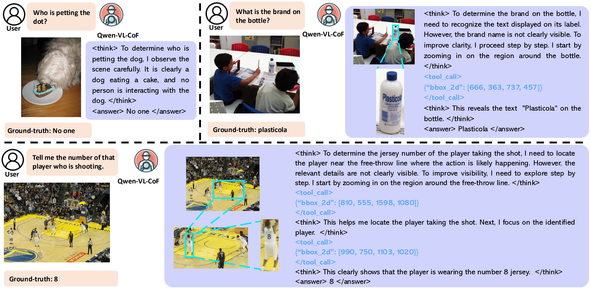
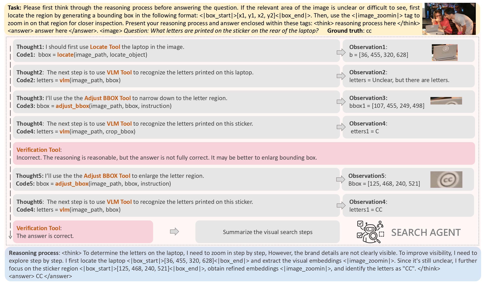
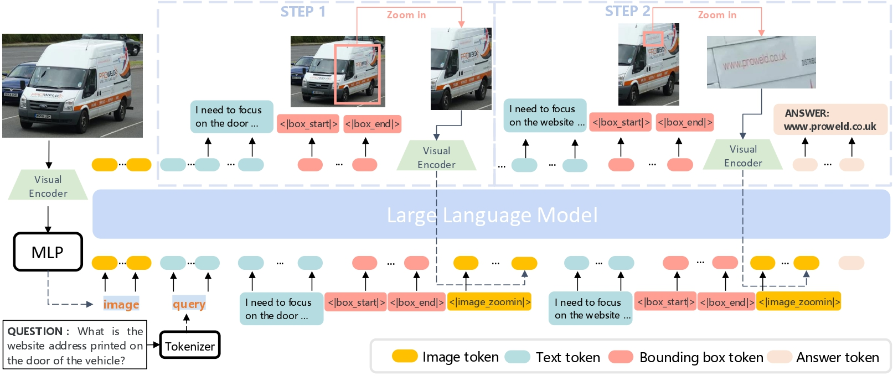
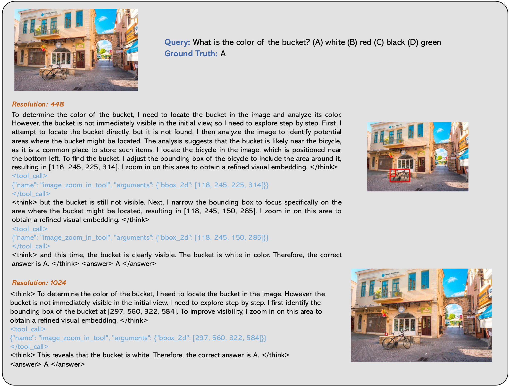
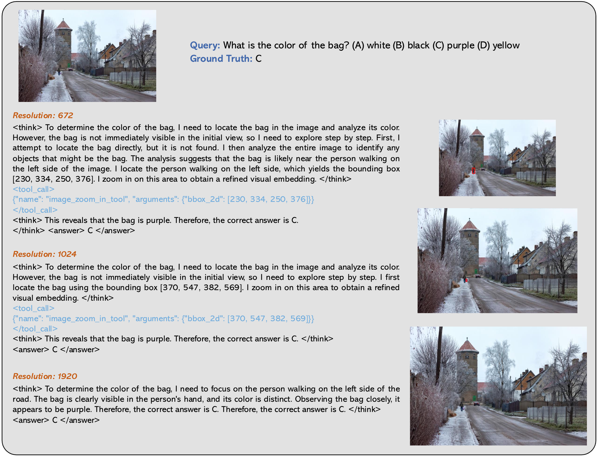
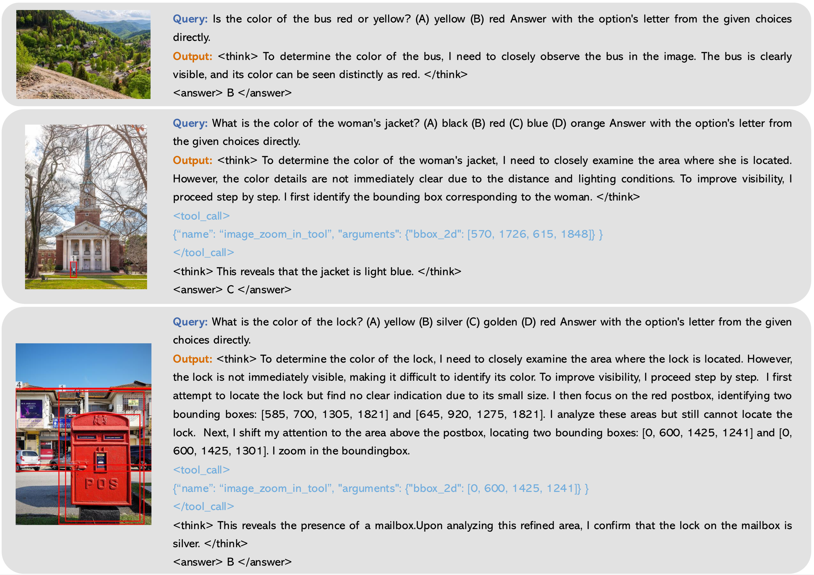

<div align="center">
  <div style="display: flex; align-items: center; justify-content: center; flex-wrap: wrap; text-align: left;">
    
    <h1 style="font-size: 40px; font-weight: bold; margin: 0;">
      Adaptive Chain-of-Focus Reasoning via Dynamic Visual Search and Zooming for Efficient VLMs
    </h1>
  </div>


  <br>


  <a href="https://arxiv.org/abs/2505.15436v2">
    
  </a>
  <a href="https://cof-reasoning.github.io/">
    
  </a>
  <a href="https://huggingface.co/xintongzhang/CoF-rl-model-7b">
    
  </a>
  <a href="https://huggingface.co/datasets/xintongzhang/CoF-SFT-Data-5.4k">
    
  </a>
</div>


<br>
<span>
<b>Authors:</b> 
<a class="name" target="_blank" href="https://github.com/xtong-zhang">Xintong Zhang<sup>*</sup></a>, 
<a class="name" target="_blank" href="https://zhigao2017.github.io/">Zhi Gao<sup>*</sup></a>, 
<a class="name" target="_blank" href="https://bofei5675.github.io/">Bofei Zhang</a>, 
<a class="name" target="_blank" href="https://pengxiang-li.github.io/">Pengxiang Li</a>, 
<a class="name" target="_blank" href="https://adatwi.github.io/">Xiaowen Zhang</a>, 
<a class="name" target="_blank" href="https://adatwi.github.io/">Yang Liu</a>, 
<a class="name" target="_blank" href="https://adatwi.github.io/">Tao Yuan</a>, 
<a class="name" target="_blank" href="https://wu-yuwei-bit.github.io/">Yuwei Wu<sup>†</sup></a>, 
<a class="name" target="_blank" href="https://scholar.google.com/citations?user=Sl6TV7gAAAAJ&hl=en">Yunde Jia</a>, 
<a class="name" target="_blank" href="https://www.zhusongchun.net/">Song-Chun Zhu</a>, 
<a class="name" target="_blank" href="https://liqing.io/">Qing Li<sup>†</sup></a>
<br>
<sup>*</sup>Equal Contribution. 
<sup>†</sup>Corresponding Author.
</span>


# 🔥News
- [2025/11/15] We released our RL dataset, model, training code, welcome to download and explore them.
welcome!
- [2025/07/09] We released our SFT dataset, model, training, and evaluation code. Welcome to download and explore them.
- [2025/05/21] We released our paper — discussions and feedback are warmly welcome!

<br>

# Overview



<details><summary>Abstract</summary> 
Vision Language Models (VLMs) have achieved remarkable success, particularly with "think-with-image" paradigms that enhance reasoning by actively image zooming to explore visual details, moving beyond reliance on purely textual thought processes. However, this approach presents a challenge in balancing performance with efficiency, as proactive zooming incurs massive computational costs and may impair global understanding. To address this problem, we introduce adaptive chain-of-focus (Adaptive-CoF), a framework that teaches VLMs to perform visual search and zooming only when necessary, based on obtained visual cues and the given questions, achieving efficient multimodal reasoning. We enable this capability through a two-stage pipeline: (1) supervised fine-tuning on an introduced MM-Adaptive-CoF SFT dataset that is constructed by a visual search agent with multi-step reasoning trajectories under diverse resolutions and question complexities, and (2) reinforcement learning with an adaptive group-aware reward (AGAR) on MM-Adaptive-CoF RL dataset, allowing the model to master an adaptive strategy. Our experiments show Adaptive-CoF achieves superior performance with exceptional efficiency. On the V* benchmark, it reduces zoom-in operations by 75% compared to proactive models and achieves comparable even better accuracy with nearly 50% fewer tokens, establishing a new paradigm for efficient and accurate VLMs.
</details>

## Visual Search Agent


## Framework


<br>

# Training

## SFT Stage

### Installation

Please follow the [LLaMA-Factory](https://github.com/hiyouga/LLaMA-Factory) repository to install the environment.

### Data Preparation

1. Download the dataset (including images and annotations) from [Hugging Face – Cof SFT Dataset](https://huggingface.co/datasets/xintongzhang/CoF-SFT-Data-5.4k)

2. Modify the configuration file `configs/sft_lora-7b.yaml` to match your data paths and training settings.
3. Copy `configs/dataset_info.json` to your image folder.

### Launch Training

Training can be started with the following script.

```bash
conda activate llamafactory
bash ./slurm_jobs/sft/train_7b_lora.sh
```

## RL Stage

### Installation

Please follow the [verl](https://github.com/volcengine/verl) repository to install the environment.

### Data Preparation

Download the dataset (including images and annotations) from [Hugging Face – CoF RL Dataset](https://huggingface.co/datasets/xintongzhang/CoF-RL-Data)


### Launch Training

Training can be started with the following script.

```bash
conda activate verl
cd ./verl
bash ./slurm_jobs/rl/run.sh
```

<br>

# Evaluation

### Installation

Set up an environment with `vllm`.

```bash
conda create -n vllm python=3.10 -y
conda activate vllm
pip install vllm==0.8.2
```

### Prepare Data and Model

The Vstar Benchmark serves as an example dataset and can be downloaded from [Vstar benchmark](https://huggingface.co/datasets/craigwu/vstar_bench).

The model can be downloaded from [Hugging Face – Cof SFT Model 7B](https://huggingface.co/xintongzhang/CoF-sft-model-7b).

### Inference

Run the inference script using vllm.

```bash
conda activate vllm
bash ./slurm_jobs/eval/inference_vstar.sh
```


### Performance Metrics

To evaluate the model's performance on the VSTAR benchmark, begin by launching a dedicated vllm server process to serve the evaluation model (e.g., a judge model):

```bash
vllm serve /path/to/Qwen2.5-VL-72B-Instruct \
    --served-model-name judge \
    --port 51232 \
    --limit-mm-per-prompt image=1 \
    --tensor-parallel-size 4 \
    --trust-remote-code \
    --disable-log-requests
```

Once the vllm service is running, execute the evaluation script to compute metrics:

```bash
bash ./slurm_jobs/eval/metrics_vstar.sh
```


### Adaptive Performance

Adaptive-CoF adjusts its zoom-in scope based on image clarity at different resolutions.


Adaptive-CoF transitions from iterative zooming to direct observation as resolution increases.


Adaptive-CoF Case studies demonstrating Adaptive-CoF’s ability to adapt its reasoning strategy. It handles simple tasks directly (top), uses a single zoom for moderately challenging tasks (middle), and engages in complex, iterative visual search for difficult, fine-grained queries (bottom).



## Citation
If you find our project helpful, please consider citing it using the following reference:
```bibtex
@article{zhang2025chain,
      title={Adaptive Chain-of-Focus Reasoning via Dynamic Visual Search and Zooming for Efficient VLMs},
      author = {Zhang, Xintong and Gao, Zhi and Zhang, Bofei and Li, Pengxiang and Zhang, Xiaowen and Liu, Yang and Yuan, Tao and Wu, Yuwei and Jia, Yunde and Zhu, Song-Chun and Qing Li},
      journal={arXiv preprint arXiv:2505.15436},
      year={2025}
}
```
