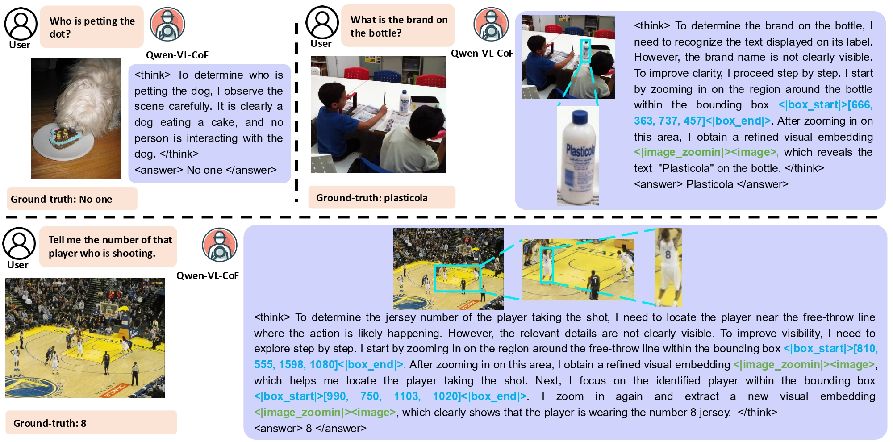

<div align="center">
  <div style="display: flex; align-items: center; justify-content: center; flex-wrap: wrap; text-align: left;">
    
    <h1 style="font-size: 40px; font-weight: bold; margin: 0;">
      Chain-of-Focus: Adaptive Visual Search and Zooming for Multimodal Reasoning via RL
    </h1>
  </div>
</div>

  <br>


  <a href="https://arxiv.org/abs/2505.15436v1">
    
  </a>
  <a href="https://cof-reasoning.github.io/">
    
  </a>
</div>


<br>
<span>
<b>Authors:</b> 
<a class="name" target="_blank" href="https://github.com/xtong-zhang">Xintong Zhang<sup>1,2*</sup></a>, 
<a class="name" target="_blank" href="https://zhigao2017.github.io/">Zhi Gao<sup>2,3*</sup></a>, 
<a class="name" target="_blank" href="https://bofei5675.github.io/">Bofei Zhang<sup>2</sup></a>, 
<a class="name" target="_blank" href="https://pengxiang-li.github.io/">Pengxiang Li<sup>1,2</sup></a>, 
<a class="name" target="_blank" href="https://adatwi.github.io/">Xiaowen Zhang<sup>2</sup></a>, 
<a class="name" target="_blank" href="https://adatwi.github.io/">Yang Liu<sup>2</sup></a>, 
<a class="name" target="_blank" href="https://adatwi.github.io/">Tao Yuan<sup>2</sup></a>, 
<a class="name" target="_blank" href="https://wu-yuwei-bit.github.io/">Yuwei Wu<sup>1,4†</sup></a>, 
<a class="name" target="_blank" href="https://scholar.google.com/citations?user=Sl6TV7gAAAAJ&hl=en">Yunde Jia<sup>4</sup></a>, 
<a class="name" target="_blank" href="https://www.zhusongchun.net/">Song-Chun Zhu<sup>2,3,5</sup></a>, 
<a class="name" target="_blank" href="https://liqing.io/">Qing Li<sup>2†</sup></a>
<br>
<sup>*</sup>Equal Contribution. 
<sup>†</sup>Corresponding Author.
</span>


## 🔥News
- [2025/5/21] We have released our paper — discussions and feedback are warmly welcome!


## Overview



<details><summary>Abstract</summary> 
Vision language models (VLMs) have achieved impressive performance across a variety of computer vision tasks. However, the multimodal reasoning capability has not been fully explored in existing models. In this paper, we propose a Chain-of-Focus (CoF) method that allows VLMs to perform adaptive focusing and zooming in on key image regions based on obtained visual cues and the given questions, achieving efficient multimodal reasoning. To enable this CoF capability, we present a two-stage training pipeline, including supervised fine-tuning (SFT) and reinforcement learning (RL). In the SFT stage, we construct the MM-CoF dataset, comprising 3K samples derived from a visual agent designed to adaptively identify key regions to solve visual tasks with different image resolutions and questions. We use MM-CoF to fine-tune the Qwen2.5-VL model for cold start. In the RL stage, we leverage the outcome accuracies and formats as rewards to update the Qwen2.5-VL model, enabling further refining the search and reasoning strategy of models without human priors. Our model achieves significant improvements on multiple benchmarks. On the V* benchmark that requires strong visual reasoning capability, our model outperforms existing VLMs by 5% among 8 image resolutions ranging from 224 to 4K, demonstrating the effectiveness of the proposed CoF method and facilitating the more efficient deployment of VLMs in practical applications.
</details>

#### Visual Search Agent


#### Framework


## Citation
If you find our project helpful, please consider citing it using the following reference:
```bibtex
@article{zhang2025chain,
      title={Chain-of-Focus: Adaptive Visual Search and Zooming for Multimodal Reasoning via RL},
      author = {Zhang, Xintong and Gao, Zhi and Zhang, Bofei and Li, Pengxiang and Zhang, Xiaowen and Liu, Yang and Yuan, Tao and Wu, Yuwei and Jia, Yunde and Zhu, Song-Chun and Qing Li},
      journal={arXiv preprint arXiv:2505.15436},
      year={2025}
}
```
